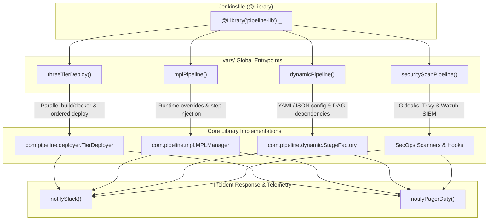

# Jenkins Pipeline Library

[](https://www.jenkins.io/doc/book/pipeline/shared-libraries/)
[](https://github.com/donny-devops/jenkins-pipeline-library/actions/workflows/ci.yml)
[](https://opensource.org/licenses/MIT)
[](https://github.com/gitleaks/gitleaks)

A modular, enterprise-ready **Jenkins Shared Library** providing reusable pipeline architectures, dynamic DAG-based stage execution, three-tier Kubernetes rollouts, SecOps scanning, and automated Slack/PagerDuty incident alerting.

---

## Architecture Overview



---

## Repository Structure

```bash
jenkins-pipeline-library/
├── vars/                                # Global variables exposed directly in pipelines
│   ├── threeTierDeploy.groovy           # 3-Tier parallel build + sequential K8s deploy
│   ├── mplPipeline.groovy               # Modular Pipeline Library (MPL) orchestrator
│   ├── dynamicPipeline.groovy           # Dynamic YAML/JSON config-driven DAG generator
│   ├── securityScanPipeline.groovy      # Gitleaks + Trivy + SIEM telemetry scanner
│   ├── notifySlack.groovy               # Rich color-coded Slack notifications
│   └── notifyPagerDuty.groovy           # PagerDuty Events API v2 incident dispatcher
├── src/com/pipeline/                    # Object-oriented, CPS-compliant Groovy classes
│   ├── deployer/
│   │   ├── TierDeployer.groovy          # Orchestrates multi-tier lifecycle & threads
│   │   ├── DockerBuilder.groovy         # Multi-architecture container builder
│   │   └── K8sDeployer.groovy           # Helm upgrades & envsubst kubectl manifests
│   ├── dynamic/
│   │   ├── PipelineConfig.groovy        # Searches & parses pipeline.yaml/json
│   │   └── StageFactory.groovy          # Resolves DAG dependsOn & executes stages
│   └── mpl/
│       └── MPLManager.groovy            # Resolves modular steps & project overrides
├── resources/
│   ├── mpl/modules/                     # Default modular step scripts
│   │   ├── Build.groovy                 # Language-aware build execution
│   │   ├── Test.groovy                  # Unit test & coverage publishing
│   │   ├── SecurityScan.groovy          # SAST, SCA, and secrets detection
│   │   ├── Docker.groovy                # Container build, tag & registry push
│   │   └── Deploy.groovy                # Helm / manifest deployments
│   └── pipeline-configs/
│       └── example-pipeline.yaml        # Full schema specification for dynamicPipeline
├── examples/                            # Ready-to-use reference applications
│   ├── three-tier-app/                  # Parallel builds + ordered K8s DB/backend/frontend rollout
│   ├── mpl-customized-app/              # MPL pipeline with .jenkins/modules/ step overrides
│   └── dynamic-dag-app/                 # Zero-code Jenkinsfile with pipeline.yaml DAG
├── tests/
│   └── test_groovy_syntax.py            # Zero-dependency test & DAG validator suite
├── .github/workflows/
│   ├── ci.yml                           # GitHub Actions CI validator & Gitleaks scan
│   └── security-hygiene.yml             # Branch protection and code hygiene check
└── skills/jenkins-pipeline-library/     # Antigravity agent skill definition
```

---

## Configuring in Jenkins

1. Go to **Manage Jenkins** → **System** → **Global Pipeline Libraries**.
2. Add a new library:
   - **Name**: `pipeline-lib` (or `jenkins-pipeline-library`)
   - **Default Version**: `main` (or a release tag like `v1.2.0`)
   - **Retrieval method**: Modern SCM → **Git**
   - **Project Repository**: `https://github.com/donny-devops/jenkins-pipeline-library.git`
   - **Credentials**: Configure git credentials if using a private mirror/fork.
   - **Load implicitly**: Leave unchecked (explicit loading with `@Library('pipeline-lib') _` is recommended).

---

## Core Pipeline Workflows

### 1. Three-Tier Kubernetes Deployment (`threeTierDeploy`)

Orchestrates microservice stacks comprising Database, Backend, and Frontend. Builds and container pushes execute in **parallel**, followed by ordered, sequential Kubernetes rollouts (`Database` → `Backend` → `Frontend`) with automated rollback and smoke tests.

```groovy
@Library('pipeline-lib') _

threeTierDeploy(
    registry    : 'registry.example.com/myteam',
    imageTag    : env.BUILD_NUMBER,
    kubeconfig  : 'prod-kubeconfig-cred',
    namespace   : 'production',
    helmTimeout : '10m',

    tiers: [
        database: [
            enabled  : true,
            type     : 'helm',                  // 'helm' | 'manifest'
            chart    : 'bitnami/postgresql',
            release  : 'myapp-postgres',
            values   : 'k8s/db-values.yaml',
            waitFor  : true,                    // Block until rollout is healthy
        ],
        backend: [
            enabled    : true,
            buildTool  : 'maven',               // maven | gradle | npm | python | docker-only
            image      : 'myapp/backend',
            context    : 'backend/',
            dockerfile : 'backend/Dockerfile',
            k8sType    : 'manifest',
            k8sDir     : 'k8s/backend/',
            healthCheck: 'http://backend-svc/health',
        ],
        frontend: [
            enabled    : true,
            buildTool  : 'npm',
            image      : 'myapp/frontend',
            context    : 'frontend/',
            dockerfile : 'frontend/Dockerfile',
            k8sType    : 'manifest',
            k8sDir     : 'k8s/frontend/',
        ],
    ],

    // Lifecycle callbacks
    onBuildSuccess : { tier -> echo "Tier ${tier} compiled and pushed successfully." },
    onDeploySuccess: { tier -> notifySlack(status: 'SUCCESS', message: "${tier} deployed to production.") },
    onFailure      : { tier, err -> notifyPagerDuty(severity: 'critical', summary: "Deployment failed on ${tier}: ${err}") },
)
```

---

### 2. Modular Pipeline Library (`mplPipeline`)

Implements the Modular Pipeline pattern. Each pipeline phase is a self-contained module. Individual repositories can override any module by simply adding `.jenkins/modules/<ModuleName>.groovy` in their repository root without changing the Jenkinsfile.

```groovy
@Library('pipeline-lib') _

mplPipeline(
    agent    : 'docker',
    registry : 'registry.example.com/myteam',
    namespace: 'staging',

    // Per-module configurations merged into default execution scripts
    modules: [
        Build       : [tool: 'maven', goals: 'clean package -DskipTests'],
        Test        : [tool: 'maven', coverageMin: 80],
        SecurityScan: [failOnCritical: true, skipSast: false],
        Docker      : [image: 'myapp/api', dockerfile: 'Dockerfile'],
        Deploy      : [type: 'helm', chart: 'myapp', release: 'api-staging'],
    ],

    // Define execution order
    stageOrder: ['Build', 'Test', 'SecurityScan', 'Docker', 'Deploy'],

    // Skip specific stages at runtime
    skip: ['SecurityScan'],

    // Conditional gate closures
    conditions: [
        Deploy: { env.BRANCH_NAME ==~ /^(main|release\/.*)$/ },
    ],
)
```

To override a stage (e.g. `Test`), create `.jenkins/modules/Test.groovy` in the application repository:

```groovy
// .jenkins/modules/Test.groovy in application repo
steps.stage('Custom Project Test') {
    steps.sh 'pytest --junitxml=results.xml tests/'
    steps.junit 'results.xml'
}
```

---

### 3. Dynamic Config-Driven Pipeline (`dynamicPipeline`)

Enables pure **Pipeline as Code** driven entirely by a YAML/JSON file inside the application repo (`pipeline.yaml`, `pipeline.yml`, or `.jenkins/pipeline.yaml`). Resolves stage dependencies via a Directed Acyclic Graph (`dependsOn`).

#### Minimal Jenkinsfile:
```groovy
@Library('pipeline-lib') _
dynamicPipeline()
```

#### Application `pipeline.yaml`:
```yaml
pipeline:
  agent: docker
  timeout: 60
  env:
    APP_NAME: auth-service
    DEPLOY_ENV: staging

stages:
  - name: Build
    type: shell
    script: mvn clean package -DskipTests -B

  - name: Unit Tests
    type: test
    script: mvn test -B
    reports:
      junit: "**/surefire-reports/*.xml"

  - name: Security Scan
    type: parallel
    stages:
      - name: SAST
        script: semgrep scan --config p/owasp-top-ten .
      - name: Secrets
        script: gitleaks detect --source . --no-git

  - name: Docker Build & Push
    type: docker
    dependsOn:
      - Build
      - Unit Tests
    image: myteam/auth-service
    registry: registry.example.com

  - name: Deploy Staging
    type: deploy
    condition: "branch in ['main', 'release/*']"
    dependsOn:
      - Docker Build & Push
    chart: myteam/auth-service
    release: auth-service-staging
    namespace: staging
```

---

### 4. DevSecOps Security Pipeline (`securityScanPipeline`)

Centralized security scanner executing Gitleaks secret detection, Trivy vulnerability & configuration scanning, and Wazuh SIEM security telemetry forwarding with automated PagerDuty / Slack failure alerting.

```groovy
@Library('pipeline-lib') _

securityScanPipeline()
```

---

### 5. Notification Utilities

#### Slack Notifications (`notifySlack`)
Generates structured Slack card webhooks with color-coded status badges:

```groovy
notifySlack(
    channel: '#ci-deployments',
    status : 'SUCCESS',                  // 'SUCCESS' (green) or 'FAILURE' (red)
    message: "Deployment of ${env.JOB_NAME} #${env.BUILD_NUMBER} completed cleanly."
)
```

#### PagerDuty Incidents (`notifyPagerDuty`)
Dispatches structured payloads conforming to the **PagerDuty Events API v2**:

```groovy
notifyPagerDuty(
    routingKey: env.PAGERDUTY_KEY,
    severity  : 'critical',             // 'info' | 'warning' | 'error' | 'critical'
    summary   : "Critical failure in ${env.JOB_NAME} #${env.BUILD_NUMBER}",
    source    : "jenkins-ci-cluster"
)
```

---

## Reference Applications (`examples/`)

Self-contained blueprints illustrating real-world adoption patterns are included in [`examples/`](examples/):

| Example Directory | Pipeline Pattern | Key Concepts Demonstrated |
| :--- | :--- | :--- |
| **[`three-tier-app/`](examples/three-tier-app/)** | `threeTierDeploy` | Parallel Maven backend & npm frontend builds, Docker builds, sequential PostgreSQL Helm + K8s manifest rollout, and smoke testing. |
| **[`mpl-customized-app/`](examples/mpl-customized-app/)** | `mplPipeline` | Modular step execution with project-level overrides in `.jenkins/modules/Test.groovy` (custom pytest/coverage) and `.jenkins/modules/Deploy.groovy` (canary releases). |
| **[`dynamic-dag-app/`](examples/dynamic-dag-app/)** | `dynamicPipeline` | Zero-code Jenkinsfile driven by `pipeline.yaml` with a Directed Acyclic Graph (`dependsOn`), parallel security scanning, and automated gating. |

---

## Local Testing & Quality Gates

The library includes a zero-dependency test suite in `tests/test_groovy_syntax.py` that validates:
- CPS compliance (`implements Serializable` for pipeline classes).
- Package and class namespace alignment.
- Global variable entrypoints (`vars/*.groovy`).
- MPL modules in `resources/mpl/modules/`.
- YAML pipeline configs and DAG acyclic dependency integrity (cycle detection via 3-color DFS).

### Run Test Suite Locally:
```bash
python tests/test_groovy_syntax.py
```

### GitHub Actions CI:
Every push and pull request executes `.github/workflows/ci.yml` verifying:
1. Python Groovy and DAG structural checks.
2. Gitleaks secret scanning across full commit history.

---

## Contributing & License

Contributions, issues, and feature requests are welcome!
Licensed under the [MIT License](LICENSE).
