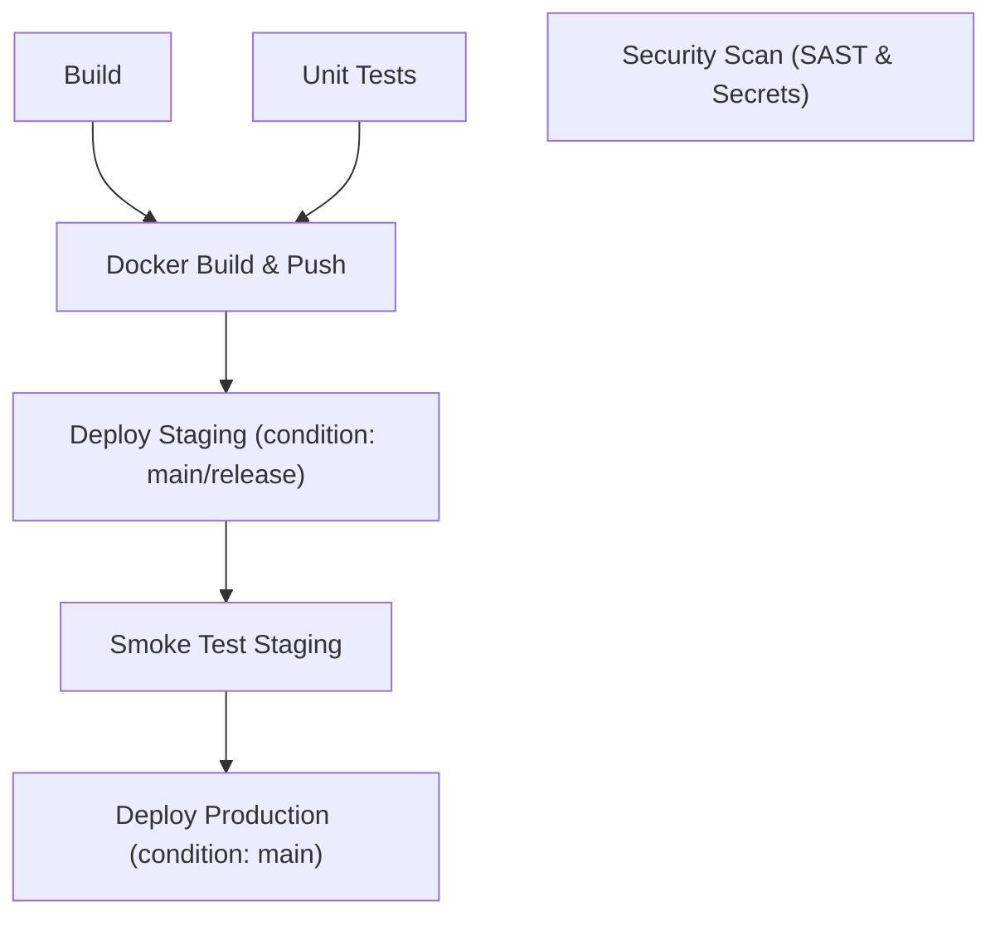

# Dynamic Config-Driven DAG Pipeline Example

This reference application demonstrates how to use `dynamicPipeline()` to run a pipeline driven entirely by `pipeline.yaml` with a Directed Acyclic Graph (DAG) for dependency management.

## Dependency Graph (DAG)

## Highlights

- **Zero Pipeline Code in Jenkinsfile**: The Jenkinsfile is a clean one-liner `@Library('pipeline-lib') _ \n dynamicPipeline()`.
- **Parallel Tasks**: The `Security Scan` stage defines parallel sub-stages (`SAST Scan`, `Secret Scan`).
- **DAG Stage Ordering**: Stages like `Docker Build & Push` declare `dependsOn: [Build, Unit Tests]`. If either fails, the dependent stage will not execute.
- **Environment & Condition Filtering**: Branch conditions (`condition: "branch in ['main']"`) ensure production deployment only runs on approved release branches.
