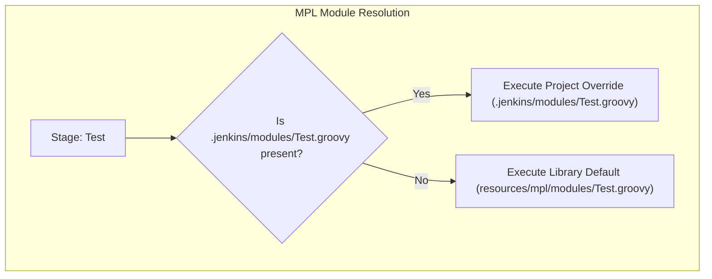

# Modular Pipeline Library (MPL) Example with Module Overrides

This reference application demonstrates how to use `mplPipeline` and override default modules at the project level.

## How Modular Overrides Work

The Jenkins Shared Library resolves modules in the following order:
1. **Project Override**: `.jenkins/modules/<ModuleName>.groovy` inside the application repository.
2. **Library Default**: `resources/mpl/modules/<ModuleName>.groovy` from the shared library.

## Included Project Overrides

- `.jenkins/modules/Test.groovy`: Replaces default test runner with custom `pytest` flags and code coverage enforcement (`--cov-fail-under`).
- `.jenkins/modules/Deploy.groovy`: Replaces default direct deploy with a progressive **Canary Deployment** pattern.

All other stages (`Build`, `SecurityScan`, `Docker`) automatically fall back to the production defaults provided by the shared library.
