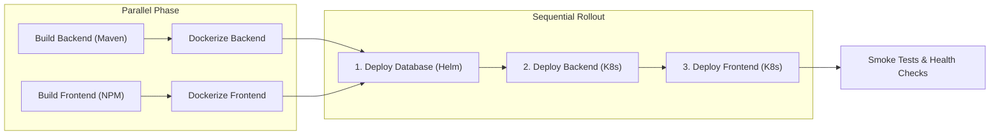

# Three-Tier App Example

This reference application demonstrates how to use `threeTierDeploy` from the **Jenkins Pipeline Library**.

## Architecture & Flow

## How It Works

1. **Parallel Builds & Dockerization**:
   - Backend Java source is compiled via Maven and packaged into a Docker container.
   - Frontend web assets are compiled via npm and packaged into an Nginx container.
   - Both image builds and pushes run in parallel branches.

2. **Ordered Kubernetes Rollout**:
   - **Database**: PostgreSQL Helm chart is deployed and verified (`waitFor: true`).
   - **Backend**: Microservice manifests are deployed with `envsubst` replacing `${REGISTRY}` and `${IMAGE_TAG}`.
   - **Frontend**: Web tier is deployed and exposed via LoadBalancer.

3. **Lifecycle Alerts**:
   - `onBuildSuccess`: Triggered when compilation completes.
   - `onDeploySuccess`: Dispatches success alert to Slack via `notifySlack`.
   - `onFailure`: Automatically fires critical incident alert to PagerDuty via `notifyPagerDuty`.
